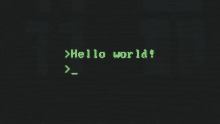

  

  
<h1 align="center">Hello everyone, I'm Leo and I am a  Software developer</h1>

  <table>
    <thead>
       <tc>
        <th>
          <strong style="color:#34C1F5">My professional stack 👨‍💻</strong>
        </th>
         <th>
        <strong style="color:#34C1F5">Want to learn 🚀</strong>
      </th>
      </tr>
    </thead>
    <tbody>
      <tr>
        <td>
          
          
          
          
          
          
          
        </td>
        <td>
          
        </td>
      </tr>
    </tbody>
  </table>

Sometimes I write about coding 👨‍💻 at <a href="https://dev.to/jleonardo007" target="_blank">dev.to</a>

